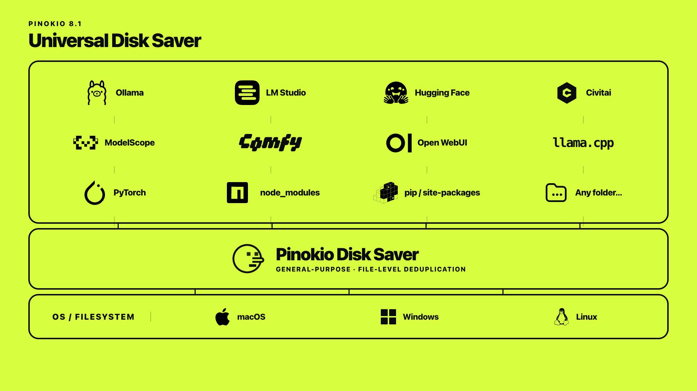

# Universal Disk Saver

> DOWNLOAD LATEST BETA: [v8.0.100](https://github.com/peanutcocktail/pinokio/releases/tag/v8.0.100)

## What problem does it solve?

As we install a lot of AI apps we get inundated with a lot of redundant files:

- redundant AI model files for different apps
- redundant runtimes (identical node modules, python modules, DLL, lib files, and so on, used by multiple apps)
- redundant files across git worktrees
- and so on.

You will be shocked to find out how much disk space you're wasting by storing the same files over and over.

## Existing approaches

Existing solutions generally follow one of three patterns:

1. **Manual linking:** Store a file once, for example in ComfyUI's model folder, then manually create symbolic links from every other app that needs it. With no system to discover or maintain those links, this is tedious and quickly becomes unmanageable.
2. **Centralized shared library:** Store models in a shared directory, then point each app to it through symbolic links or app-specific configuration. Every app must know about this architecture and be adapted to support it.
3. **Centralized cache:** Libraries such as `huggingface_hub`, `diffusers`, and `transformers` automatically store and reuse files from one cache. This is convenient, but separates a model from the lifecycle of the app that downloaded it. Deleting the app leaves the model behind, so caches accumulate files whose current use, and whether they are safe to delete, is unclear.

## Problem with existing approaches

### Manual Linking

- It's too much hassle
- Cannot be automated
- Becomes a mess as you keep creating links, you have to decide which one becomes the canonical location, etc.

### Automated sharing systems

- **Requires Work:** They encode domain-specific knowledge, such as recognized model categories, known application directories, or library-specific caches. **This means their reach is limited to rules implemented by developers**, so every new application, file category, or ecosystem requires another integration.
- **Domain Specific:** Because their scope ends at the environment they manage, you can't save disk space OUTSIDE of the environment the system has control over. These systems do not compare files inside that environment with unrelated software, global environments, or folders managed by other tools. (For example, if you have a Qwen model downloaded in LM Studio, and a self-contained web app that packages the same Qwen model in the app, you can't deduplicate between the two (The whole point of LM Studio's model management system is to **avoid duplicate model files** by storing them in a **centralized library**, and it does not care about anything outside of it).

## The Solution

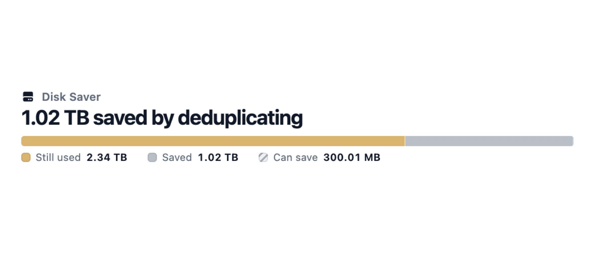

Pinokio Disk Saver takes a new, different approach. Every app keeps its own files and folder structure, while byte-identical files share one physical copy underneath (achieved using a [content addressable storage](https://en.wikipedia.org/wiki/Content-addressable_storage))

1. **General deduplication:** Existing deduplication schemes are uusually domain specific--only deduplicate AI model files, etc.--Pinokio Disk Saver is designed to be general purpose. Not just AI models, but NPM dependency files, PIP dependency files, LIB files, DLL files, commonly used binary files (.exe, etc.), pretty much anything. This is because Disk Saver does not need to understand models, packages, runtimes, applications, folder conventions, file locations, or symbolic links. There is no special domain specific logic. It only verifies whether files are byte-identical. New file types, frameworks, and ecosystems require no additional deduplication logic.
2. **Zero configuration, Zero convention:** Deduplication is purely content based. Even if two files have different file names they can still be deduplicated, while preserving their existing paths. No central `models` folder or shared cache is required. No need to configure anything. Files remain exactly at the paths where their apps created them. Much easier to understand what's going on, while still taking advantage of deduplication.
3. **System-wide Deduplication:** You can deduplicate ANY folder on your computer. Deduplication is not bounded by the software Pinokio manages. User-added locations on the same drive can share identical files with Pinokio or with one another, including a global Conda environment, an LM Studio model library, a Ollama model library, models embedded in standalone llama.cpp applications, or even your entire user home folder.
4. **Autoscan (Mac & Windows):** Thanks to vertical integration with Pinokio's runtime and scripting, the deduplication scanning can kick in and notify you only when it matters. You don't even have to keep manually running scans. Every time you run an app, Autoscan checks files created or changed by the app after it stops. Do nothing and keep your file system as optimized as possible. Any app launched in pinokio benefits from autoscan.

Because of its flexibility and general purpose nature, it can recover hundreds of gigabytes or even terabytes of disk space on your machine. You would be shocked to find out how much disk space you've been wasting, you will find duplicate files you don't even remember.

## What it looks like

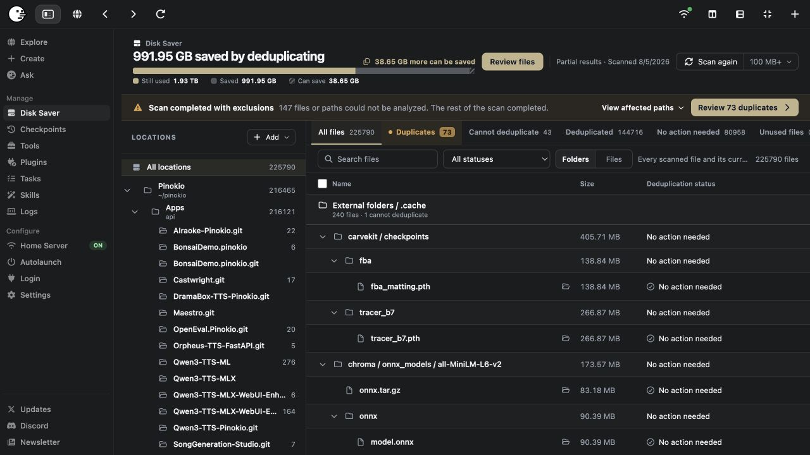

1. **Scan for potential saves:** Safely scan any folder to find potential disk space you can save by deduplicating.
2. **Deduplicate with 1-click:** Once you discover duplicate files, just click once to deduplicate them, and instantly free up your disk space.
3. **Roll back to duplicate with 1-click:** Any deduplicated file can be restored to an independent copy with **Make separate**, which will recreate the duplicate files in the exact same locations.
4. **Reference-aware cleanup:** Deleting one app does not affect files still used by other apps. If you have 3 apps that use the same model file, after the final app that uses the model is deleted, Disk Saver lists the data under **Unused files** for cleanup (similar to "Recycle Bin" on Windows or "Trash" on Macs).

## How scanning works

1. **Pinokio Home Scan:** By default, it scans everything inside your Pinokio home. Run a global scan and it will find all the redundant files scattered across your apps. Then, you can deduplicate them all with 1-click.
2. **App-specific Scan:** You can also scan and deduplicate for each app.
3. **System-wide Scan:** You are not limited to Pinokio. You can scan your entire computer. You can even add model libraries, caches, old Pinokio Homes, project folders, and any other locations on your computer.

## How deduplication works

So what exactly does it mean by "duplicate", and what does it mean when you "deduplicate"?

1. **Duplicates:** Duplicates mean there are multiple files on your computer that have the exact same bytes. Multiple files can have different file names and paths but as long as they have the same content, they are "duplicates".
2. **Deduplication:** When you deduplicate, the deduplicated file names still exist at the locations. But internally they are linking to one disk space (inode).
3. **Deletion:** Let's say you have 5 duplicate files and you deduplicated. This leads to 5 file paths all pointing to the same underlying disk space (inode). When you delete one of them, it removes that reference and won't show up on the file explorer anymore. However the underlying disk space still exists. You can keep deleting the rest of the 4 locations, and ONLY after you've deleted ALL 5 references, you will get the option to "clean up".
4. **Clean up:** Once you remove all 5 duplicates, now you can finally delete the actual underlying disk space. This will show up inside the "Unused files" tab. You can remove them with 1-click. This is similar to "Empty trash" (mac) or "Empty recycle bin" (windows)

## How safe is it?

1. **Scan** is read-only, and 100% safe.
2. Deduplication is **precisely based on content.** Files are deduplicated only when their contents are exactly identical. Matching filenames or locations are not enough.
3. **Deduplication**, **Make separate**, or **Clean up** actions DO make changes to your file system.
4. **Deduplication** and **Make separate** can be safely reverted. Once you deduplicate a file, you can "Make separate" to separate the deduplicate entity back to independent files.

# Features

These screenshots are from Pinokio 8.1. Your file names, counts, and storage totals will be different. The checks below each screenshot cover the main things to test.

## 1. Run the first global scan

In Pinokio's left sidebar, find the **Manage** section and click **Disk Saver**. Choose a minimum file size and start the scan. A larger minimum is faster; a smaller one may find more savings.

You can scan **10 MB+, 50 MB+, 100 MB+, 500 MB+, or 1 GB+**. The 10 MB minimum avoids sharing ordinary source, configuration, and other small files that are more likely to be edited in place. Empty files are ignored.

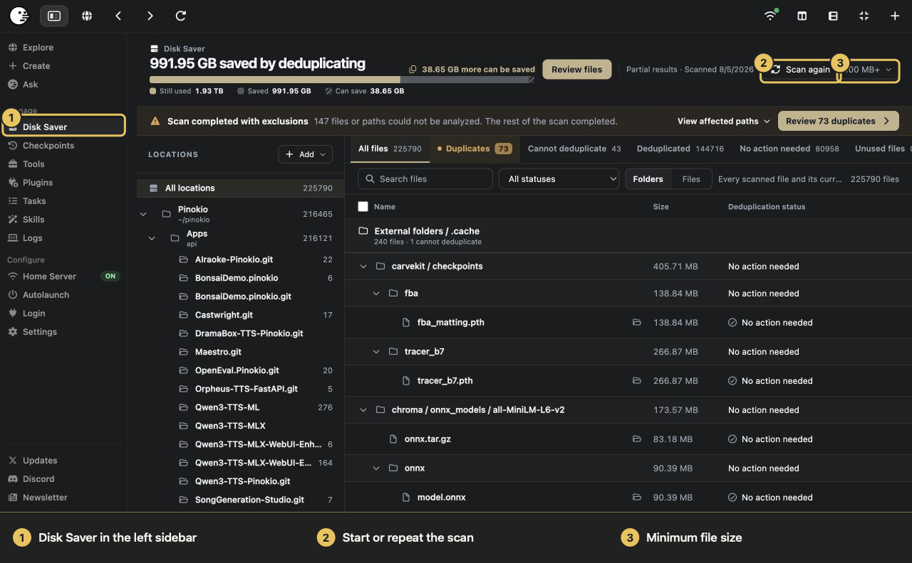

> **What to test**
>
> - Start a scan and watch its progress.
> - Cancel it, then start again.
> - Change the minimum size and run another scan.
> - If a path cannot be read, the rest of the scan should finish and an exclusions notice should appear.
> - Scanning alone should not link, replace, or delete anything.

## 2. Understand the result views

Each view answers a different question:

- **All files:** every non-empty file that met the size limit.
- **Duplicates:** identical files you can deduplicate.
- **Cannot deduplicate:** identical files that cannot safely share storage.
- **Deduplicated:** files already sharing storage.
- **No action needed:** files with no duplicate action to take.
- **Unused files:** private Disk Saver links left after their app files were deleted.
- **Activity:** a record of Disk Saver changes.

Use Search, status and location filters, and the **Folders / Files** switch to narrow the list.

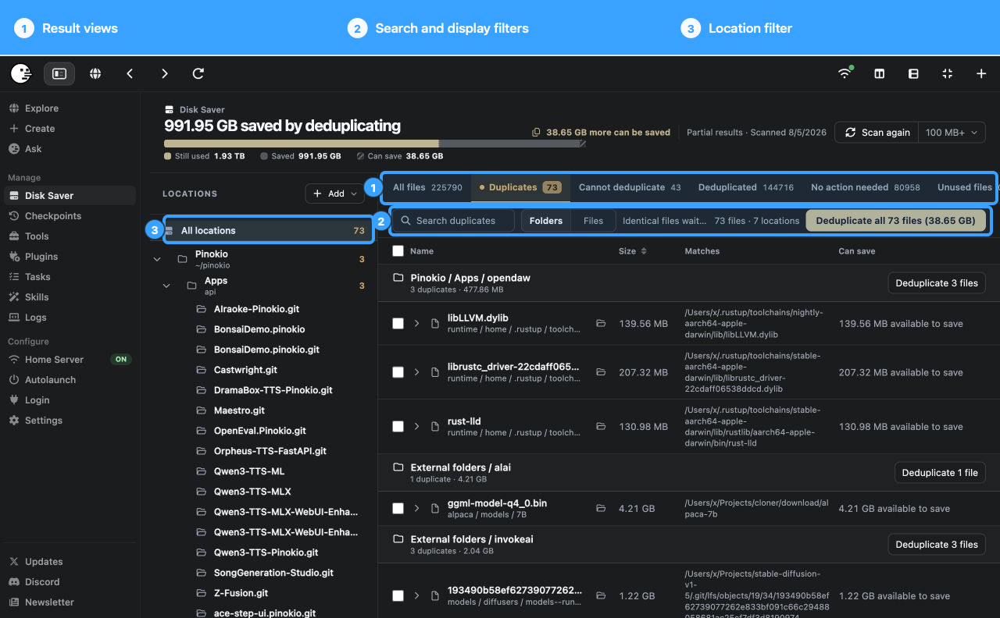

> **What to test**
>
> - Open every view and compare its count with the files shown.
> - Search for part of a file or folder name.
> - Switch between Folders and Files.
> - Choose one location. Its actions should not affect another location.

## 3. Read the scan summary

The scan summary separates what you use now from what you could save:

- **In use:** physical space currently occupied.
- **Saved:** space already avoided through deduplication.
- **Can save:** space available from eligible duplicates, found through scanning.

The numbers update after each action. It is normal for the logical file total to be larger than the physical storage used: several paths can point to the same data.

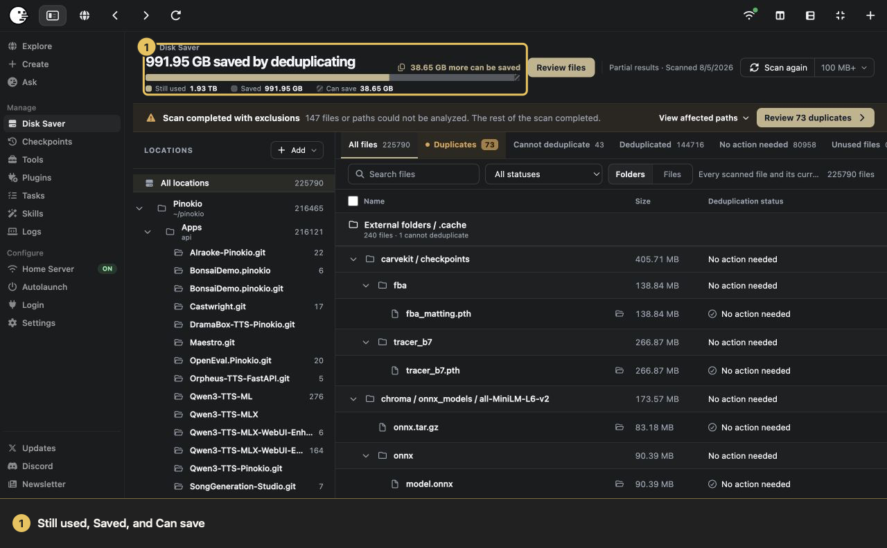

> **What to test**
>
> - Note all three values.
> - Deduplicate one test file. **Saved** should rise while **Can save** falls.
> - Make it separate again. The values should move back.

## 4. Deduplicate one or many files

The Duplicates view groups byte-identical files and shows where each match lives. You can act on one file, select up to 500 rows, deduplicate a folder or location, or choose **Deduplicate all**.

Every path stays in place. Pinokio replaces only the redundant storage with a hardlink to the same verified content.

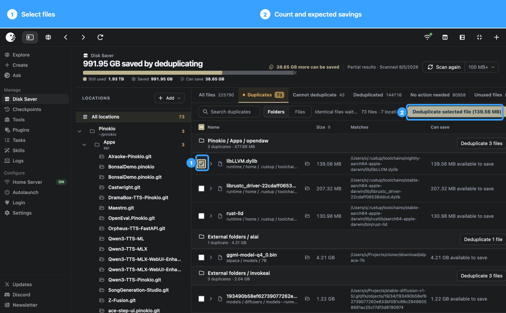

> **What to test**
>
> - Select one disposable duplicate first.
> - The button should show the selection count and expected savings.
> - After deduplicating, both paths should still exist and their checksums should match the originals.
> - The file should move to **Deduplicated** and appear in Activity.
> - A location-level action should not touch other locations.

Pinokio may skip a file if it changed after the scan or belongs to a running app. Close the app and scan again.

## 5. See why a file cannot be deduplicated

Matching contents are not enough. Files must also have compatible permissions, ownership, filesystems, and locations. Disk Saver puts unsafe matches under **Cannot deduplicate** and tells you why.

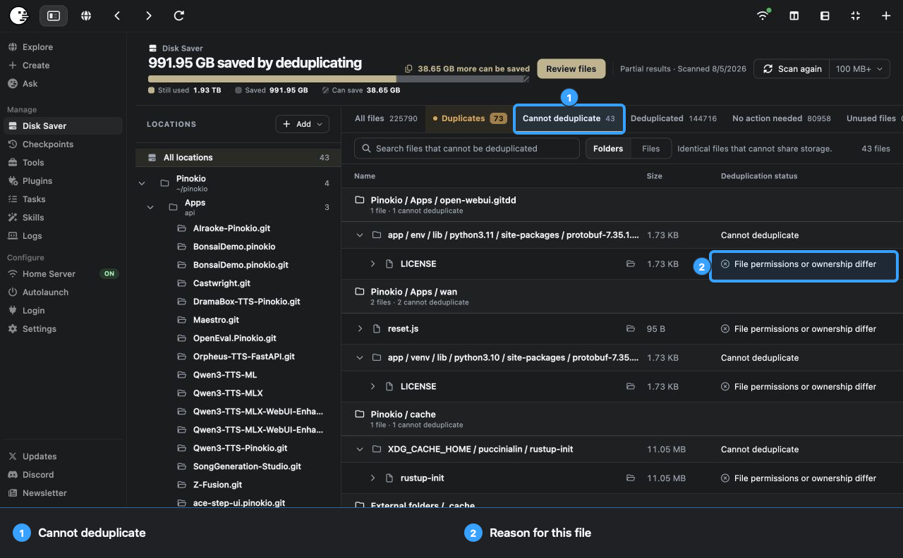

> **What to test**
>
> - This view should have no bulk Deduplicate action.
> - Every row should give a reason.
> - If you see **Try again**, fix the temporary access problem and retry.
> - One unreadable path should not discard the rest of the scan.

## 6. Make a file separate again

**Make separate** reverses deduplication. Pinokio gives the selected path its own physical copy without changing its name or location.

Use it before editing a file in place, making an independent archive, or simply testing the undo path. You may need free space equal to the full file size.

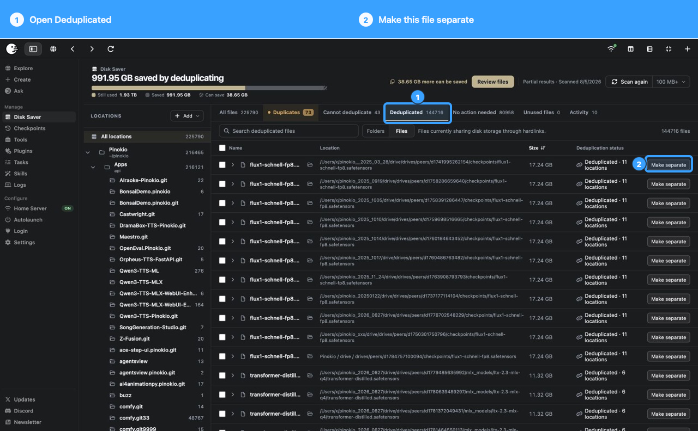

> **What to test**
>
> - Make one disposable deduplicated file separate.
> - Its path and checksum should stay the same.
> - It should no longer share an inode with the other copy.
> - Try a checkbox selection and review the larger-batch confirmation.
> - Look for the separation in Activity.

## 7. Clean up unused private links

Disk Saver keeps a private, verified link to managed content. If all matching app paths are later deleted, that link becomes unused and appears under **Unused files**.

Cleanup is conservative: Pinokio only removes an unchanged private link when its link count proves that nothing still depends on it. An empty view with **No cleanup needed** is normal.

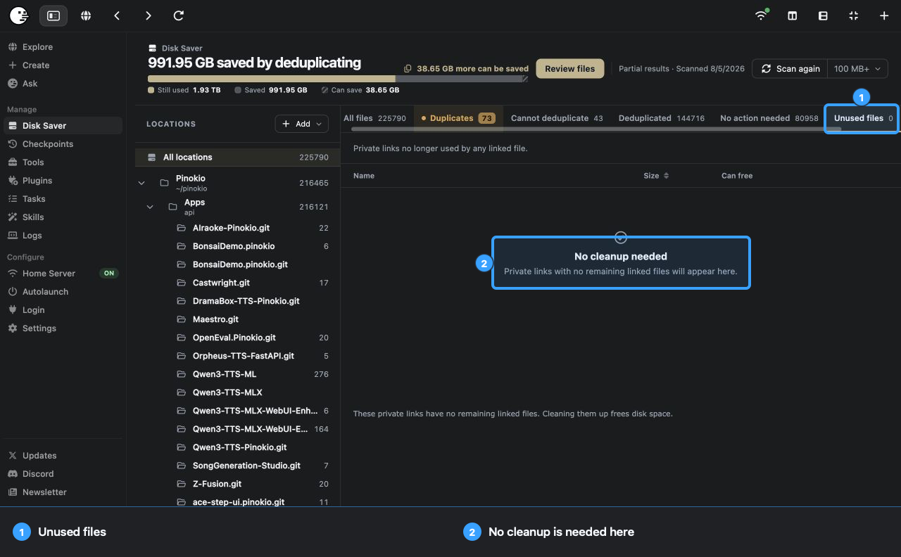

> **What to test**
>
> - If unused links exist, review their count and reclaimable size.
> - Clean up one, then try **Clean up all**.
> - An in-use private link should not be removable.
> - Look for the cleanup in Activity.

## 8. Add folders outside Pinokio Home

Choose **Add**, then **Add folder**, to include a model library, download cache, project archive, old Pinokio Home, or any folder you control. It appears under **Other folders**, where you can filter, scan, or remove it independently.

Removing a location from Disk Saver only stops tracking it. It does not delete the folder.

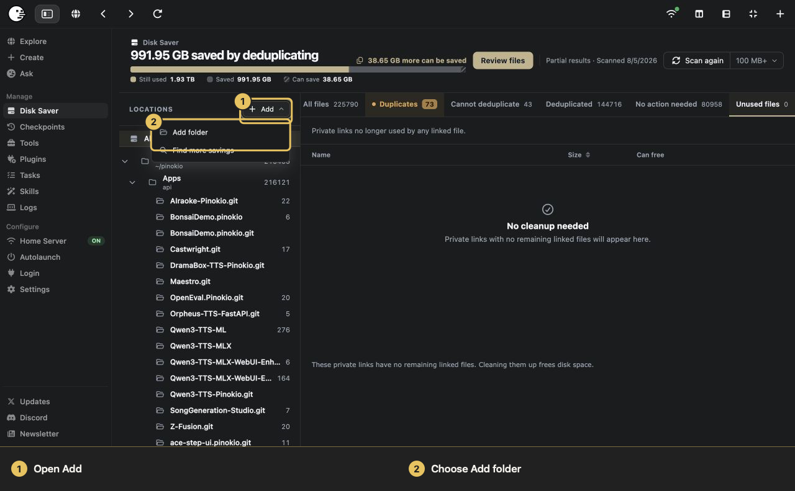

> **What to test**
>
> - Add a small folder with disposable duplicates.
> - Scan and find it under Other folders.
> - Deduplicate only that location.
> - Remove the location. The real folder should still be there.

## 9. Find more savings elsewhere

After the global scan, choose **Add**, then **Find more savings**, to search your Home folder, another folder, or another drive. Set a minimum size, review the suggestions, and add only the locations you want.

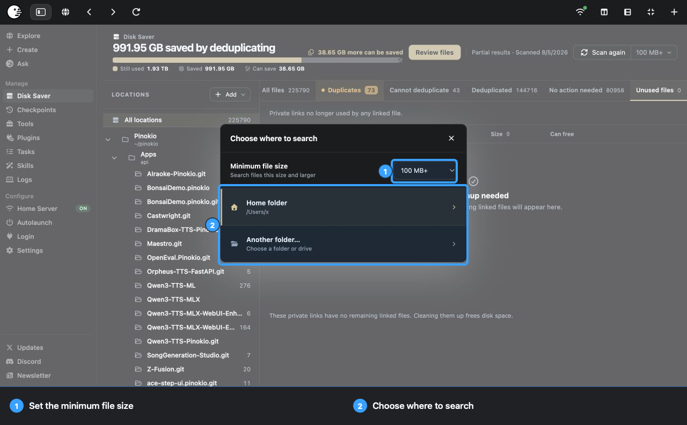

Disk saver cannot cross filesystems. Files on an external SSD can share space with each other, but not with a file on the internal drive.

> **What to test**
>
> - Search Home. Locations already managed by Disk Saver should be skipped.
> - Cancel a search. Nothing should be added.
> - Search another folder and review suggestions before accepting them.
> - On a hardlink-compatible external drive, deduplicate two files on that drive.
> - Cross-drive matches should not offer a Deduplicate action.

## 10. Scan one app

Every installed app has its own Disk Saver page. It shows the app's **Unique**, **Shared**, and **Can save** bytes, and every action stays scoped to that app.

Run the global scan first so Pinokio has a verified set of files to compare against.

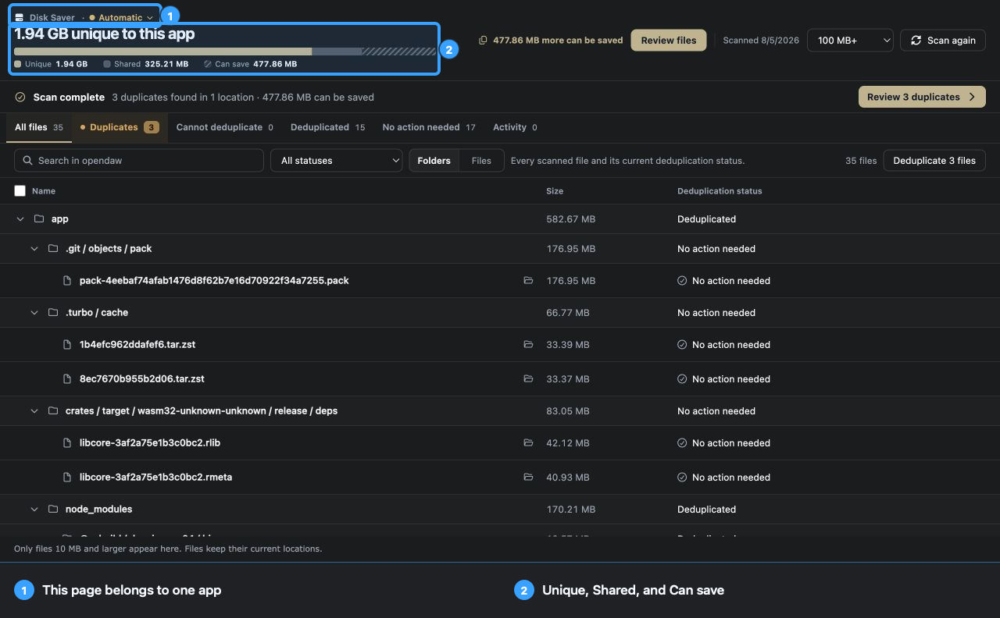

> **What to test**
>
> - Open an app, choose Disk Saver, and scan it.
> - Change its minimum-size setting.
> - Review the Unique / Shared / Can save summary.
> - Deduplicate from this page. Unrelated apps should be untouched.

## 11. Autoscan

Set an app's Disk Saver control to **Auto** or **Manual**. In Auto mode, Pinokio watches which files the app changes, then checks eligible files after the app stops.

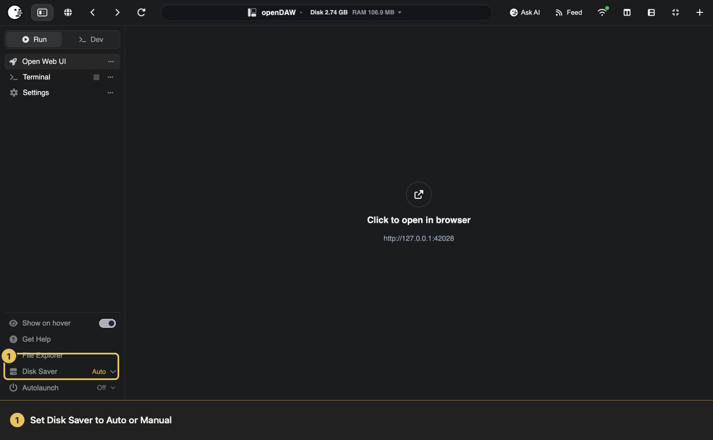

When Autoscan finds a new verified match to review, a red **New** badge appears beside **Disk Saver** in the app sidebar. The badge is only a notification: Auto mode never deduplicates files by itself. Open Disk Saver to inspect the result and choose whether to act. Once you open the new result, Pinokio marks it reviewed and clears the badge.

> **What to test**
>
> - Switch between Auto and Manual, then reopen the app page.
> - In Auto mode, let the app create or download a large duplicate and then stop it.
> - **New** should appear only after Pinokio finds a verified match.
> - Open the result. **New** should clear.
> - Manual mode should not run the automatic check.

## 12. Review Activity and skipped files

Activity is a history of completed Disk Saver changes. Each entry shows the action, how many files changed, the size, and the time. Use the search box to find older entries.

Activity is not an undo button. Use **Make separate** to reverse deduplication. Skipped files do not appear as successful Activity entries. After a partial scan or action, open the exclusions notice to see which paths were skipped and why.

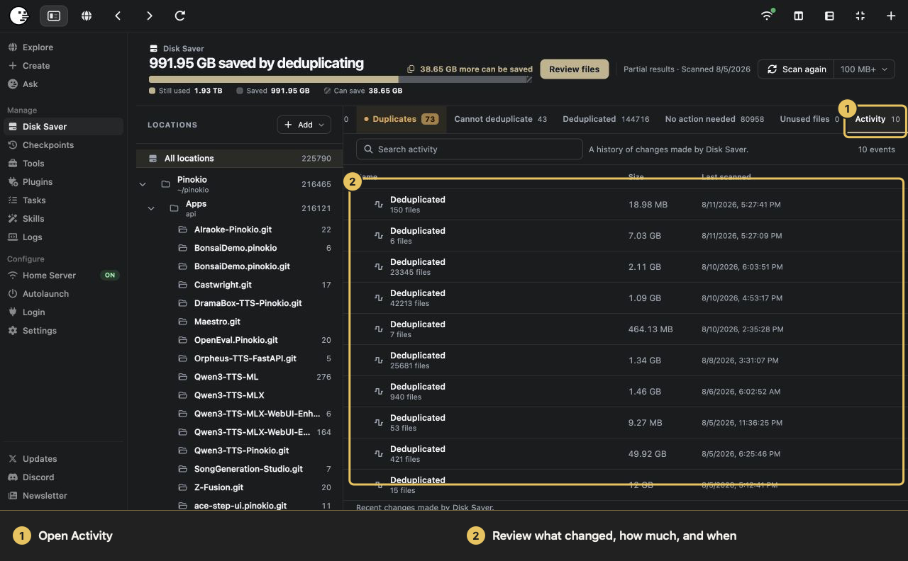

> **What to test**
>
> - Deduplicate a file, make it separate, and clean up an unused file. Confirm each completed action appears in Activity.
> - Search Activity, leave the page, and come back. The entries should remain.
> - Scan a harmless unreadable test folder. The exclusions notice should list the path and reason.
> - Cancel a long action. Unfinished files should not appear as successful Activity entries.

# Use cases

Disk Saver is most useful for large files that rarely change but have been copied into several tool-specific folders.

## Keep app installs disposable without wasting space

Without Disk Saver, apps usually handle models in one of two ways:

- **No Deduplication:** Each app keeps its own models. Uninstalling is simple, but every copy takes space.
- **Centralized Deduplication:** Apps use a central cache or shared folder (for example a `models` folder to store all the common models). This saves space, but deleting an app leaves the shared model behind.

With Disk Saver, each app still sees a normal file in its own folder. Identical files can share the same data underneath.

Here is what that looks like:

1. App A downloads `model.safetensors` into its own folder.
2. App B downloads the identical model into its folder.
3. Disk Saver verifies both and makes them share one physical copy.
4. Delete App A. Its folder disappears; App B keeps working.
5. Delete App B. Its path disappears too. The final private link appears under **Unused files**, where you can safely clean it up.

| Approach | App paths | Storage | Delete one app | Make one app independent |
|---|---|---|---|---|
| Separate copies | Inside each app | Repeated | Deletes its copy | Already independent |
| Shared folder, symlinks, or cache | Points to a central location | Shared | Leaves the central model | Copy and reconfigure |
| Pinokio Disk Saver | Inside each app | Shared for identical files | Deletes only that app's path | Choose **Make separate** |

`HF_HOME`, for example, points Hugging Face downloads to one shared cache. Disk Saver leaves the app paths where they are and deduplicates exact matches in place. See the [Hugging Face cache documentation](https://huggingface.co/docs/huggingface_hub/main/guides/manage-cache).

There is no new file format here. Pinokio uses hardlinks and handles the fiddly parts for you: finding matches, checking their contents, separating them again, and cleaning up leftovers.

## One model, many AI apps

ComfyUI, InvokeAI, image generators, trainers, audio tools, and custom launchers may all download the same checkpoint.

Suppose three apps each contain the same 17.24 GB model. They can keep all three paths while using one physical copy, saving about 34.48 GB. The names can differ; the contents cannot.

## Old Pinokio Homes and rollback copies

Folders such as `pinokio-old`, `pinokio-working`, and a fresh Pinokio Home are useful during an upgrade, but their repeated models and runtimes are expensive.

Add the old folders and deduplicate their stable overlap. Each directory tree remains complete for rollback. If an old Home is on another drive, it can only share space with files on that drive.

## Python environments and runtimes

Apps often install the same PyTorch wheels, CUDA libraries, Python packages, Node or Electron binaries, Rust toolchains, FFmpeg builds, and browser runtimes.

Ten environments containing the same 200 MB library can share one copy and save about 1.8 GB. The environments remain separate and their imports do not change.

## Hugging Face and app caches

A model may exist in the Hugging Face cache and again inside several apps. Add the cache, scan it with Pinokio Home, and review exact matches.

Use this when symlinks confuse an installer or an app insists on its own path.

## Forks, worktrees, and experiments

Copying a working project is a quick way to start an experiment. The source code is usually small; copied environments, models, test data, and build artifacts are not.

Keep every experiment self-contained while unchanged files share storage. Use **Make separate** before editing a shared file in place.

## Downloads, installers, and archives

Download folders collect repeated `.zip`, `.tar`, `.dmg`, `.pkg`, model, and dataset files, often under different names. These are good candidates because they rarely change.

Add the archive folders as they are. Disk Saver keeps their structure and only offers exact matches.

## Datasets and media libraries

Training data, stock assets, sound libraries, textures, footage, and exports often get copied into several projects.

Deduplicate finalized or read-only assets. Keep databases, active project files, and media that an editor rewrites separate. If needed, use **Make separate** before editing.

## Build farms and development caches

Branches and apps can repeat entire dependency trees and toolchains. Start with a **100 MB** or **500 MB** scan to catch the large native binaries, then lower the limit if the extra scan time is worthwhile.

## Portable workspaces on external SSDs

An SSD may hold several self-contained AI workspaces. Add its folders and deduplicate files within that drive. The paths remain portable and the space is saved on the SSD.

The drive must use a filesystem that supports hardlinks. FAT-family filesystems generally do not.

## Find duplicates without changing them

You can also use Disk Saver as an inventory. Scan, search, compare paths, and inspect exclusions without deduplicating anything. This can uncover accidental downloads, explain why a migration doubled in size, or show which app owns a large file.

## Clean up after uninstalling apps

Deleting an app removes its folder and model paths. If another app still links to the same content, that app keeps working. After the final app path is gone, the verified private link may appear under **Unused files** for cleanup.

You stay in control of that last deletion, and Activity records it.

# How Disk Saver works

1. Pinokio scans the selected locations without following symbolic links.
2. It uses file size, filesystem, metadata, and file identity to narrow the search.
3. It hashes possible matches with SHA-256. Only byte-for-byte matches qualify.
4. You review the results. The scan has not changed anything.
5. When you choose Deduplicate, Pinokio replaces the redundant storage with a hardlink on the same filesystem.
6. Make separate copies a linked path back to an independent file.
7. Clean up removes a private link only after checking that it is unchanged and unused.

## What a hardlink means

A hardlink is another name for the same physical file data. It is not a shortcut. Every path behaves like a normal file, and deleting one path leaves the data available through the others.

If an app changes the bytes **in place**, every hardlink sees the change. Models, archives, runtimes, and other read-only files are the safest choices. Use **Make separate** before editing.

Many apps save by writing a new temporary file and renaming it over the old one. That naturally gives the changed path its own data, but not every app works this way.

## Safety checks

Before changing a path, Disk Saver checks it again. It skips files that changed after the scan, belong to a running Pinokio app, have incompatible metadata, are unavailable, or live on an unsupported or different filesystem.

Actions use temporary files and atomic replacement where possible. Completed work appears in Activity; failed or unprocessed files stay visible and untouched.

# Frequently asked questions

## Does Disk Saver delete duplicate files?

No. Deduplication keeps every selected path and removes only redundant physical storage. Cleanup removes unused private links after safety checks.

## Do names or paths change?

No. Apps keep using the same paths.

## Does deleting one hardlink delete the others?

No. It removes that one path. The data remains while another hardlink exists. Editing the bytes in place is different, so separate writable files first.

## What happens when I delete an app?

The app's folder and model paths are deleted. Other app paths keep working. When the final app path is gone, the private Disk Saver link can appear under **Unused files**; **Clean up** removes it after checking that nothing depends on it.

That gives you app-by-app uninstall behavior without requiring a permanent central model library.

## Can it deduplicate across drives?

No. Hardlinks cannot cross filesystem boundaries. Disk Saver can manage several drives, but files only share storage with compatible files on the same drive.

## Why is an identical file under Cannot deduplicate?

The contents match, but another safety check failed. The row gives the reason: permissions, ownership, hardlink support, different drives, denied access, or a reference Pinokio could not verify.

## Is a scan destructive?

No. A scan reads metadata and hashes possible matches. Only **Deduplicate**, **Make separate**, and **Clean up** change files.

## Is this a backup?

No. Deduplication saves local space; it does not create an independent copy. Keep a real backup on separate storage, and check whether your backup software preserves or expands hardlinks.

## Can I stop using Disk Saver?

Yes. Use **Make separate** for files that should become independent. Removing an added location stops tracking it but does not delete its files.
