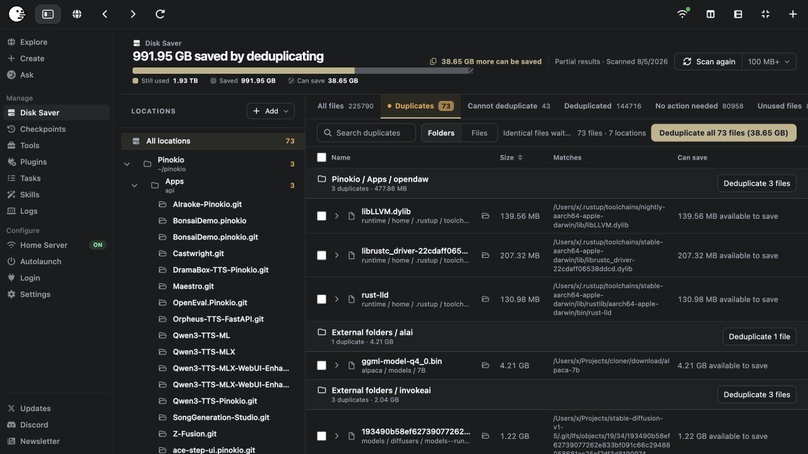
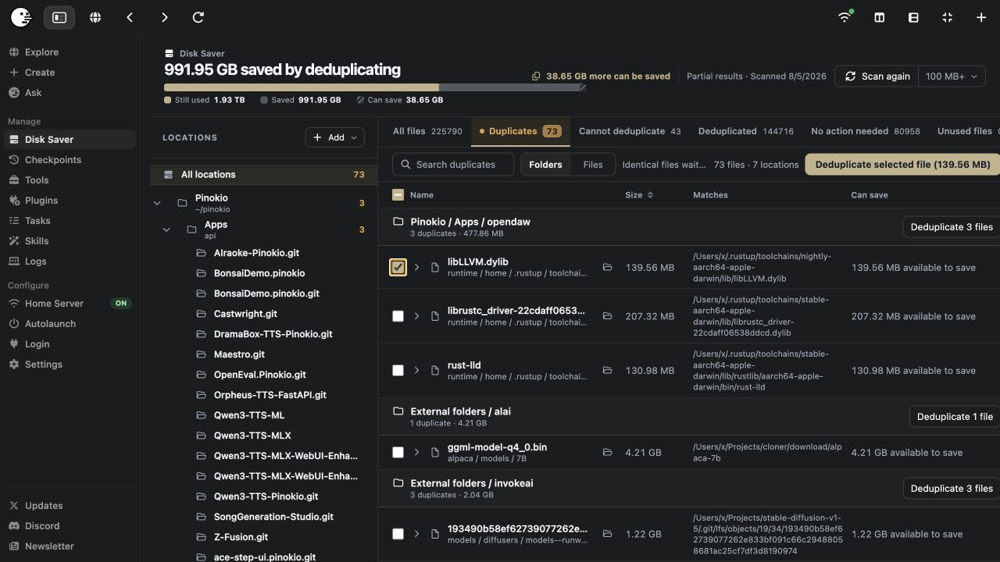
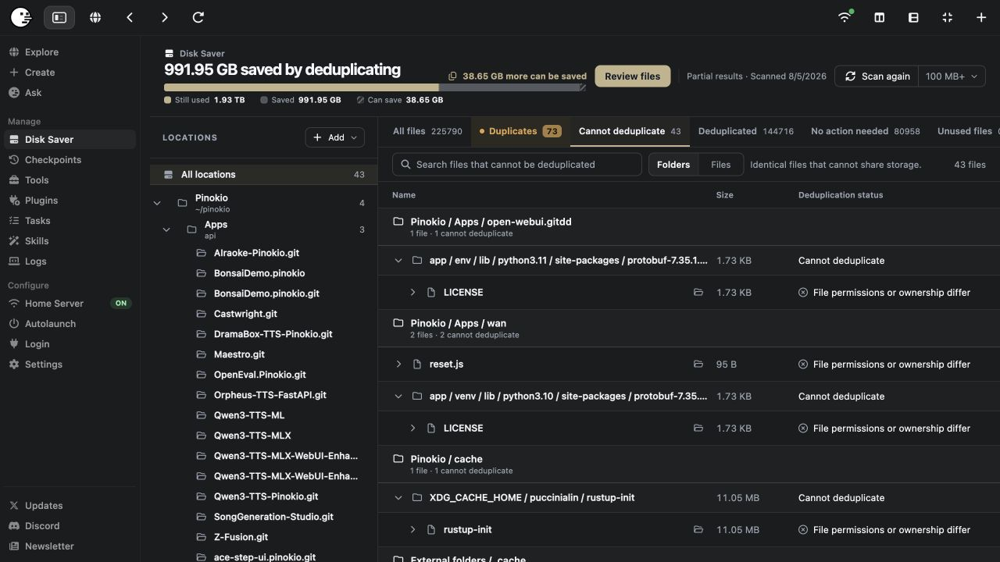
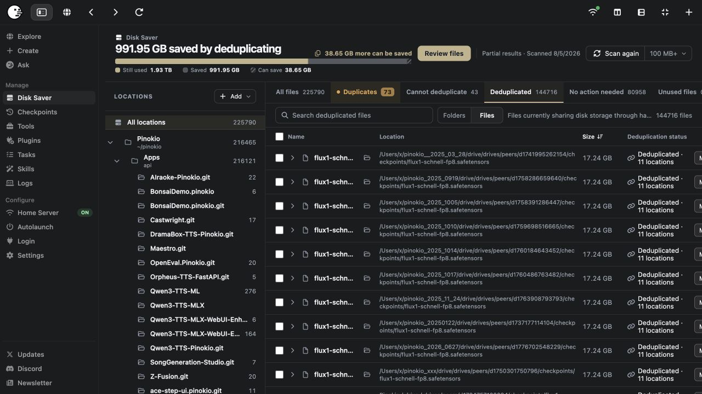
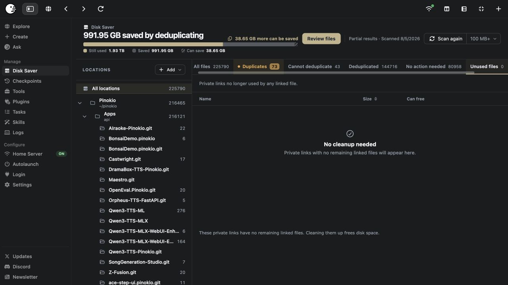
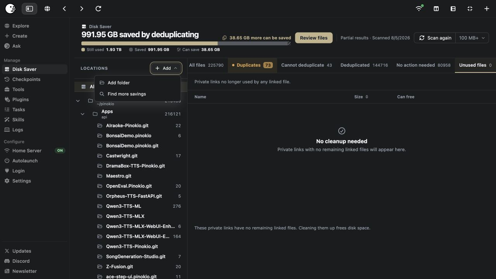
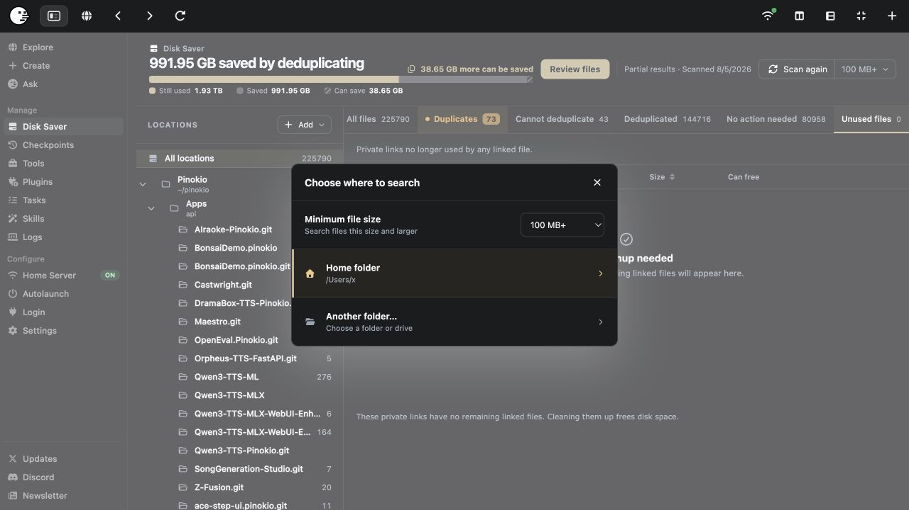
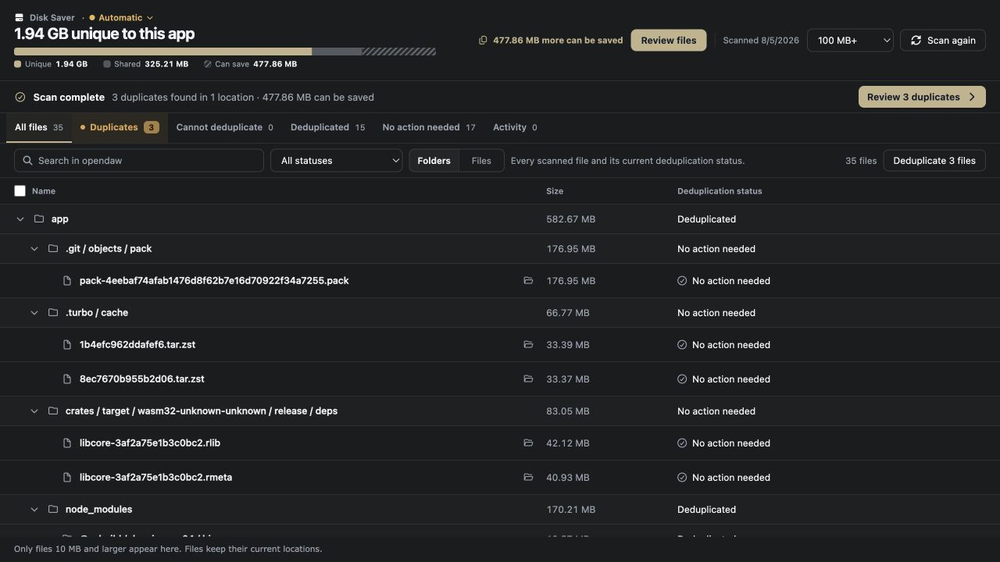
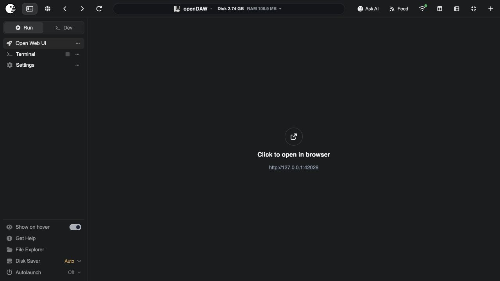
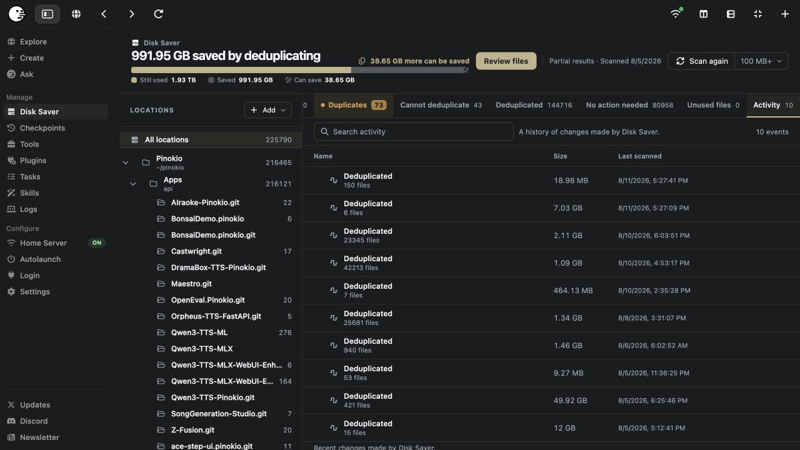

# Pinokio 8.1 — Disk Saver

Pinokio 8.1 introduces **Disk Saver**, a way to reclaim space from byte-for-byte identical files without moving them, renaming them, or changing the paths that apps expect.

Disk Saver starts with Pinokio Home and can also scan folders you choose elsewhere on the computer. It is especially useful for local AI installations, where the same models, runtimes, environments, and cached downloads often appear in many apps.

> **The important safety rule:** scanning only reports opportunities. Pinokio does not deduplicate anything until you review the results and choose a Deduplicate action.

[Download Pinokio](https://desktop.pinokio.co/)

# Features to test

The screenshots in this section come from the actual Pinokio 8.1 interface. The file names, counts, and space totals are examples; your results will be different.

## 1. Run the first global scan

Open **Manage → Disk Saver**. Choose the minimum file size and run the initial scan. Larger thresholds finish sooner; smaller thresholds inspect more files and may find more savings.

The available thresholds are **All files, 1 MB+, 10 MB+, 50 MB+, 100 MB+, 500 MB+, and 1 GB+**. Empty files are ignored.

**Test this**

- Start a scan and confirm that progress is visible.
- Cancel a scan, then start it again.
- Change the minimum file size and confirm that the next scan uses it.
- If some paths cannot be read, confirm that the rest of the scan completes and an exclusions notice appears.
- Confirm that no files are linked, removed, or replaced by scanning alone.

## 2. Understand the result views

Disk Saver separates results into views so that an opportunity is never confused with a completed action:

- **All files** — every non-empty scanned file at or above the selected size.
- **Duplicates** — identical files that can be deduplicated after review.
- **Cannot deduplicate** — identical files that cannot safely share storage.
- **Deduplicated** — files already sharing storage through hardlinks.
- **No action needed** — scanned files with no current duplicate action.
- **Unused files** — private Disk Saver links left after their linked files were deleted.
- **Activity** — a history of changes made by Disk Saver.

Use Search, the status filter, location filters, and **Folders / Files** display modes to narrow the list.

**Test this**

- Switch through every result view and confirm that its count and explanation agree.
- Search for part of a file or folder name.
- Switch between Folders and Files.
- Select a location in the left rail and confirm that actions remain limited to that location.

## 3. Read the storage summary

The summary answers three different questions:

- **Still used** — physical storage still occupied by the scanned files.
- **Saved** — storage already avoided through deduplication.
- **Can save** — additional storage available if every currently eligible duplicate is deduplicated.

The headline and storage bar update as actions finish. A large logical total is normal: several paths can refer to the same physical file data.

**Test this**

- Record the three values before an action.
- Deduplicate a small test file and confirm that **Saved** increases while **Can save** decreases.
- Make the same file separate and confirm that the summary moves in the opposite direction.

## 4. Deduplicate one file, a selection, a folder, or all results

The Duplicates view groups byte-identical files and shows their matching location. You can act on a single row, select up to 500 rows at once, deduplicate a folder or location, or use **Deduplicate all**.

The path used by each app stays where it is. Disk Saver replaces an eligible copy with a hardlink to the same verified content, so the duplicate names share one physical set of bytes.

**Test this**

- Start with one disposable duplicate and use its checkbox.
- Confirm that the action button reports the selected count and expected savings.
- After the action, confirm that both paths still exist and their checksums are unchanged.
- Confirm that the row moves to **Deduplicated** and appears in Activity.
- Try a location-level action and confirm it does not affect duplicates outside that location.

If an app is running or a file changes after the scan, Pinokio may skip it rather than act on stale information. Close the app and scan again.

## 5. See why a file cannot be deduplicated

Identical contents are not the only requirement for a safe hardlink. Disk Saver gives ineligible files their own **Cannot deduplicate** view instead of hiding them among actionable duplicates.

Common reasons include different permissions or ownership, a filesystem without hardlink support, files on different disks, an unavailable path, or a stored reference that can no longer be verified.

**Test this**

- Confirm that this view never shows a bulk Deduplicate action.
- Confirm that each row shows a reason.
- If a temporary permission error offers **Try again**, fix access and retry.
- Confirm that inaccessible paths produce partial results instead of invalidating the successful part of the scan.

## 6. Make a deduplicated file separate again

**Make separate** is the reverse operation. Pinokio copies the selected linked file to a new physical file while keeping its name and path unchanged.

This is useful before editing a file in place, moving a project into an independent archive, or testing the undo path. Separating a file may require up to that file's full size in free disk space.

**Test this**

- Choose one disposable row in **Deduplicated** and click **Make separate**.
- Confirm that the file remains in the same path with the same checksum.
- Confirm that it no longer shares an inode with its former peers.
- Test checkbox selection and the confirmation shown for a larger batch.
- Confirm that Activity records the separation.

## 7. Clean up unused private links

Disk Saver keeps a private verified link for managed content. If every linked app path is later deleted outside Disk Saver, that private link can become unused. The **Unused files** view lets you reclaim it safely.

Disk Saver only removes an unchanged private link whose link count proves that no managed file still depends on it. An empty view and **No cleanup needed** are healthy states.

**Test this**

- If unused links are present, review their count and reclaimable size.
- Clean up one item, then test **Clean up all**.
- Confirm that a private link still in use cannot be cleaned up.
- Confirm that the cleanup appears in Activity.

## 8. Add folders outside Pinokio Home

Use **Add → Add folder** to include a model library, download cache, project archive, older Pinokio Home, or another folder you control. Added folders appear under **Other folders** and can be filtered or removed from Disk Saver independently.

Removing a location from Disk Saver stops tracking it; it does not delete the folder or its files.

**Test this**

- Add a small folder containing disposable duplicate files.
- Scan and confirm that it appears under Other folders.
- Deduplicate only that location and confirm that other locations are untouched.
- Remove the location from Disk Saver and confirm that the real folder remains.

## 9. Find more savings in Home, another folder, or another drive

After a global scan, **Add → Find more savings** can search outside the current Locations. Choose your Home folder or another folder or drive, and choose the minimum file size before searching.

Disk Saver verifies suggested matches before offering them. You can review the suggested folders and add only the locations you want.

Hardlinks cannot cross filesystems. Treat each disk as its own deduplication island: copies on one external SSD can share storage with one another, but an internal-disk file cannot hardlink to an external-disk file.

**Test this**

- Search Home and confirm that already-managed Locations are skipped.
- Cancel a search and confirm that no location is added.
- Search a second folder and review the suggestions before accepting them.
- On an external drive that supports hardlinks, confirm that duplicates on that same drive can be deduplicated.
- Confirm that cross-drive matches appear as unavailable rather than actionable.

## 10. Scan and manage one app

Every installed app has its own Disk Saver page. It shows that app's unique bytes, bytes already shared, and bytes that can still be saved. Actions launched here stay scoped to the app.

An initial global scan is required first because it supplies the verified comparison set used by app-level scans.

**Test this**

- Open an app, choose Disk Saver, and run its scan.
- Confirm that its minimum-size setting can be changed independently.
- Confirm that the summary uses **Unique / Shared / Can save**.
- Deduplicate from the app page and confirm that unrelated apps are not included in the action.

## 11. Use automatic app checking

Each app's Disk Saver control can be set to **Auto** or **Manual**. In Auto mode, Pinokio watches which files an app changes while it runs and checks eligible files after the app stops.

When verified duplicates are found, the app's Disk Saver control shows a **New** result indicator. Opening the result acknowledges that batch. Automatic checking never deduplicates files by itself: you still choose the minimum size and review the action.

**Test this**

- Toggle an app between Auto and Manual and reopen the app page.
- In Auto mode, let an app create or download a large duplicate, then stop the app.
- Confirm that a New result appears only after a verified match is found.
- Open Disk Saver, review the batch, and confirm that the New indicator clears.
- Confirm that Manual mode does not run the automatic check.

## 12. Review activity and recover from partial failures

Activity records successful deduplication, separation, and unused-link cleanup events with file counts, sizes, and timestamps. It is an audit trail, not a one-click undo list; use **Make separate** when you want to reverse a deduplication.

**Test this**

- Perform one action of each kind and confirm that it is recorded.
- Search Activity and confirm that recent events remain after leaving the page.
- Trigger a harmless partial scan, such as an unreadable test folder, and confirm that affected paths are listed.
- Confirm that cancelling a long file action stops future items without misreporting unfinished work as successful.

# Powerful use cases

Disk Saver is most valuable when large, mostly immutable files are copied into several places because different tools expect different directory layouts.

## One model library, many AI apps

ComfyUI, InvokeAI, image generators, trainers, audio tools, and custom launchers may each download the same checkpoint into their own model directory.

**Example:** three paths named `flux1-schnell-fp8.safetensors` contain identical 17.24 GB data. After review, the paths stay inside their original apps but share one physical copy. Roughly 34.48 GB can be saved.

This also works when the file names differ. Disk Saver compares content, not names.

## Old Pinokio Homes, migrations, and rollback copies

Keeping `pinokio-old`, `pinokio-working`, and a fresh Pinokio Home is convenient during an upgrade, but models and runtimes dominate their size.

Add the older folders and deduplicate the stable overlap. You retain each complete directory tree for rollback while repeated files share storage. If an old Home is on another disk, deduplicate it with other copies on that disk rather than with the internal drive.

## Python environments and native runtimes

Independent apps often install the same PyTorch wheels, CUDA libraries, Python packages, Node or Electron binaries, Rust toolchains, FFmpeg builds, and browser runtimes.

**Example:** ten virtual environments each contain the same 200 MB native library. Deduplicating nine redundant copies can save about 1.8 GB without merging the environments or changing their import paths.

## Hugging Face and application download caches

A model may exist once in a Hugging Face cache and again under several app folders. Add the cache folder, scan it alongside Pinokio Home, and review byte-identical matches.

This is useful when symlinking a shared model folder would break an app installer or when different apps insist on owning their own paths.

## Forks, worktrees, experiments, and copied repositories

AI experiments are frequently started by duplicating a working project. Source code is small, but copied environments, compiled artifacts, test fixtures, and models are not.

Disk Saver lets every experiment keep a self-contained layout while large unchanged files share storage. Make a file separate before deliberately editing it in place.

## Downloads, installers, and archives

Download folders accumulate repeated `.zip`, `.tar`, `.dmg`, `.pkg`, model, and dataset files with inconsistent names. These are strong candidates because they are generally immutable and checksums are easy to verify.

Add the relevant archive folders instead of reorganizing them. Disk Saver preserves the original folder structure and only offers exact matches.

## Dataset and media asset libraries

Training datasets, stock assets, sound libraries, texture packs, raw footage, and exported deliverables are often copied into multiple project folders.

Use Disk Saver for finalized or read-only assets. Avoid deduplicating working databases, active project files, or media that an editor may rewrite in place unless you make the working copy separate first.

## Build farms and local development caches

Multiple branches or apps can contain identical dependency trees and compiled toolchains. Large native binaries are especially good targets even when thousands of smaller source files remain below the scan threshold.

Start at 100 MB or 500 MB for a quick high-value pass, then lower the threshold if the extra scan time is worthwhile.

## External SSDs used as portable workspaces

An external SSD may contain several self-contained AI workspaces so it can move between machines. Add the folders on that SSD and deduplicate the overlap within the drive.

The workspace paths remain portable, and the savings stay on the SSD. Verify that the drive's filesystem supports hardlinks; FAT-family filesystems generally do not.

## Duplicate discovery without taking action

Disk Saver is also a content inventory. You can scan, search, compare paths, inspect exclusions, and decide that a duplicate should remain independent.

This makes it useful for finding accidental model downloads, diagnosing why a migration doubled in size, or identifying which app owns a large file even when you never click Deduplicate.

## Reclaiming leftovers after uninstalling apps

Deleting an app can leave a now-unused private Disk Saver link. The Unused files view makes this visible and lets you reclaim it after verifying that no linked app path remains.

This turns cleanup into an explicit, auditable step rather than a hidden background deletion.

# How Disk Saver works

1. **Inventory:** Pinokio walks the selected Locations without following symbolic links and records eligible non-empty files.
2. **Candidate filtering:** size, filesystem, metadata, and known file identity reduce unnecessary work.
3. **Verification:** candidate contents are hashed with SHA-256. Only byte-identical files qualify.
4. **Review:** results are published as Duplicates, Cannot deduplicate, Deduplicated, or No action needed. The scan itself changes nothing.
5. **Deduplicate:** after your action, Pinokio safely replaces an eligible copy with a hardlink to verified content on the same filesystem.
6. **Separate:** Pinokio can atomically copy a linked path back to an independent file.
7. **Cleanup:** a verified private link is removable only after it is unchanged and no linked path still uses it.

## What a hardlink means

A hardlink is another file name for the same physical file data. It is not a shortcut: every linked path works as a normal file, and deleting one name does not delete the data while other links remain.

However, an application that overwrites bytes **in place** changes the shared content seen through every hardlink. That is why Disk Saver is best for models, archives, runtimes, and other immutable assets. Use **Make separate** before in-place editing.

Many applications save safely by writing a new temporary file and renaming it over the old path. That naturally breaks the link for the replaced path, but you should not assume every application behaves this way.

## Safety checks

Before changing a path, Disk Saver rechecks file identity and metadata. It skips files that changed after the scan, files used by a running Pinokio app, metadata-incompatible files, unavailable paths, and files on an unsupported or different filesystem.

Actions use temporary files and atomic replacement where possible. Partial failures remain visible, successful actions are recorded, and the unprocessed files stay untouched.

# What to deduplicate

| Strong candidates | Use caution or keep separate |
|---|---|
| Model weights and checkpoints | Databases and virtual disk images |
| Installers and compressed archives | Logs and frequently rewritten caches |
| Python wheels and native libraries | Active project files edited in place |
| Runtime and browser binaries | Files that must be independent failure copies |
| Finalized datasets and media assets | Files on different disks |
| Old app or Pinokio Home copies | Merely similar or differently compressed files |

Disk Saver requires exact contents. Two models with the same architecture, two videos that look identical, or two archives containing the same files do not qualify unless their bytes are identical.

# A safe five-minute test

1. Create a temporary folder on the same disk as Pinokio Home.
2. Put two byte-identical disposable files in it. A large copied model or archive makes the savings easy to see.
3. Add the folder to Disk Saver and run a scan with a threshold below the test file size.
4. In Duplicates, select one copy and deduplicate it.
5. Confirm that both paths still open and have the same checksum.
6. Use Make separate and confirm that both files still open.
7. Delete the temporary files normally, then review Unused files if a private link becomes reclaimable.

# Frequently asked questions

## Does Disk Saver delete duplicate files?

No. Deduplication keeps every selected path and replaces redundant physical storage with hardlinks. Cleanup only removes unused private Disk Saver links after safety checks.

## Do names and paths change?

No. Apps continue to use the same paths.

## Does deleting one hardlink delete the others?

No. Deleting a path removes that name. The data remains while another hardlink exists. In-place modification is different: it changes the shared bytes, so separate a writable file first.

## Can it deduplicate across internal and external drives?

No. Hardlinks cannot cross filesystem boundaries. Disk Saver can manage multiple drives, but savings are calculated and applied within each compatible drive.

## Why are identical files under Cannot deduplicate?

Their contents match, but another safety requirement does not. Check the row for permission or ownership differences, lack of hardlink support, different disks, a permission denial, or a reference verification problem.

## Is a scan destructive?

No. A scan reads metadata and hashes candidate contents. Only an explicit Deduplicate, Make separate, or Clean up action changes files.

## Is this a backup?

No. Deduplication saves local storage; it does not create another independent copy. Keep a real backup on separate storage. Backup software also differs in how it preserves or expands hardlinks, so verify its behavior.

## Can I stop using Disk Saver later?

Yes. Use Make separate for managed files that you want to make physically independent. Removing an added Location stops tracking it but does not delete its files.

# Feedback

When reporting a problem, include your operating system, filesystem type, selected minimum file size, the affected view, the reason shown for any unavailable file, and whether the source app was running. Screenshots of the exclusions notice or Activity entry are especially useful.

Join the [Pinokio Discord](https://discord.gg/TQdNwadtE4) or follow [Pinokio updates](https://x.com/cocktailpeanut).
